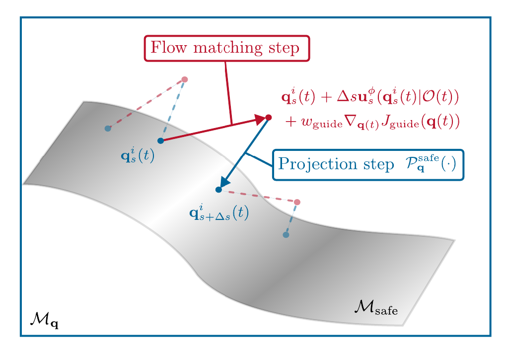
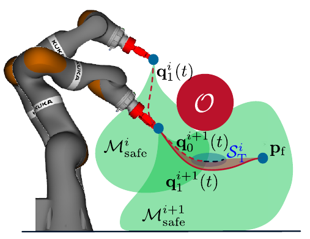

# SafeFlowMPC: Predictive and Safe Trajectory Planning for Robot Manipulators with Learning-based Policies

Implementation of the SafeFlowMPC (published at ICRA 2026). See here [https://www.acin.tuwien.ac.at/en/42d6/](https://www.acin.tuwien.ac.at/en/42d6/) for a video of real-world experiments.

This repository includes the training and inference code for the first experiment in the paper.
If you find any mistakes, bugs, or have further suggestions, feel free to reach out or create an issue.




## Dependencies

The implementation uses [Acados](https://docs.acados.org/) to solve a non-convex optimization problem in each flow matching step. Please follow their website for the installation instructions.

Install the Python requirements using

```
pip install -r requirements.txt
```

and the SafeFlowMPC package using

```
pip install -e .
```

## Running example experiments

In order to run the example experiments run

```
python python inference_global_planner.py
```

or

```
python python inference_global_planner.py  --replan
```

which runs inference with the initial configuration and goal pose provided by the example files in the `data` directory.
The checkpoints of the model are obtained from huggingface (see below).
Optionally, the `--replan` flag enables random replanning instances during the execution.

## Training

There is no reason to create the datasets yourself as it is available on huggingface for [pretraining](https://huggingface.co/datasets/ThiesOelerich/SafeFlowMPC_pretrain) and [finetuning](https://huggingface.co/datasets/ThiesOelerich/SafeFlowMPC) and automatically loaded by the training scripts. But if you want to create them yourself, the section at the end of this README explains how.

You can just train the models (the datasets are loaded automatically) using:

```
mkdir checkpoints
python train_imitation_learning.py
python train_imitation_learning_safe.py
```

The first command pretrains a model on the dataset without safety considerations. The second command finetunes the model on the dataset with safety considerations. Please refer to the paper for more information about this.

## Checkpoints

The checkpoint used for the experiments in the paper can be downloaded from [huggingface](https://huggingface.co/ThiesOelerich/SafeFlowMPC).
It should be placed in the `checkpoints` directory (which you have to create).
However, there is no need to do this manually, the scripts will look for the models and load them from huggingface if they are not found.

## Dataset creation

In order to create the dataset, the VP-STO planner [https://github.com/JuJankowski/vp-sto](https://github.com/JuJankowski/vp-sto) is used. It is included in this repository as the code was slightly modified. We thank the authors of VP-STO for open sourcing their code.
The dataset creation of `NR_TRAJS` is performed with

```
mkdir data
python dataset_creation/vpsto_planning.py --nr_trajs NR_TRAJS
```

followed by

```
python dataset_creation/create_imitation_dataset_vpsto.unsafe.py
python dataset_creation/create_imitation_dataset_vpsto.py
```

These commands create the correct format to train the flow matching model. By default, 4000 trajectories are created. This takes quite some time and creating the correct format for the flow matching is also expensive as safe intermediate trajectories have to be created.
If you do not want to train your own model, just download the checkpoint as described below.
